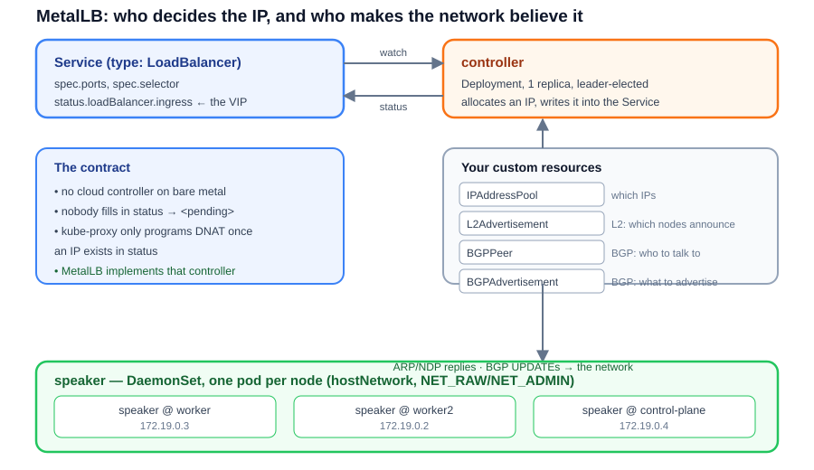
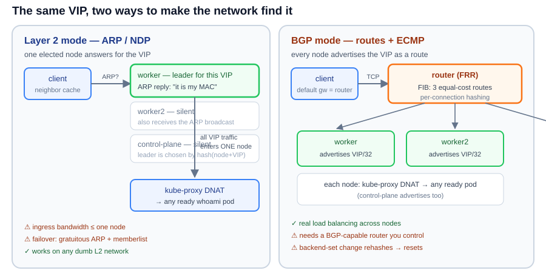

# MetalLB on Bare Metal — a hands-on course

Learn how a bare-metal Kubernetes cluster gets `LoadBalancer` services: from a Service stuck at `<pending>` forever, to **ARP/NDP-announced VIPs** and **real BGP peering** with a router — all simulated on a single Linux machine (kind + an FRR container), and then straight into the **Go code** that makes it work.

## The lessons (run them in order)

**Phase 1 — Layer 2 with MetalLB (kindnet cluster, Lessons 0–4)**

| # | Lesson | What you do |
|---|--------|-------------|
| **0** | [Concepts](lesson-00-concepts/README.md) | why `<pending>` happens, controller vs speaker, L2 vs BGP, the packet path |
| **1** | [The cluster & the problem](lesson-01-cluster/README.md) | build a 3-node kind cluster, deploy an app, watch `EXTERNAL-IP` stay `<pending>` |
| **2** | [Install MetalLB](lesson-02-install/README.md) | Helm install, tour every component and CRD it creates |
| **3** | [Layer 2 mode: your first VIP](lesson-03-l2/README.md) | `IPAddressPool` + `L2Advertisement`, then watch ARP hand you the VIP |
| **4** | [Layer 2 deep dive](lesson-04-l2-deep/README.md) | per-VIP leader election, a real node failure, gratuitous ARP, `externalTrafficPolicy` |

**Phase 2 — BGP with Calico (rebuilt cluster, Lessons 5–8)**

| # | Lesson | What you do |
|---|--------|-------------|
| **5** | [Phase 2: rebuild the cluster on Calico](lesson-05-calico-cluster/README.md) | new Calico cluster, then MetalLB installed **controller-only** — allocation without a speaker |
| **6** | [BGP with Calico](lesson-06-bgp-calico/README.md) | Calico peers with a real router and announces the VIPs; ECMP, `/32`s, `BGPFilter` |
| **7** | [Advanced addressing](lesson-07-advanced/README.md) | reserved pools, pinned addresses, IP sharing, per-namespace pools — and internal-only VIPs the Calico way |
| **8** | [Operations & troubleshooting](lesson-08-operations/README.md) | metrics and alert rules, a failure-mode matrix, safe upgrades — with the phase-2 mapping |

**Part II — Internals: read and extend the Go code**

| # | Lesson | What you do |
|---|--------|-------------|
| **9** | [Tour of the Go codebase](lesson-09-go-tour/README.md) | clone and build `metallb/metallb`, follow a Service from the reconcile loop to the ARP reply, run the unit tests |
| **10** | [Inside `internal/layer2`](lesson-10-go-layer2/README.md) | the candidate set, the sha256 election (reimplemented and verified against the live cluster), the ARP responder, the GARP spam loop, memberlist |
| **11** | [Write your own Go controller](lesson-11-go-controller/README.md) | build `poolwatch`: a controller-runtime operator that finds Services whose address nobody announces — and deploy it into the lab |

## Prerequisites

- Linux with **Docker** and **kind** (`docker` must be usable without `sudo`) — no GPU, no cloud account
- **kubectl**, **helm**, **curl**, **tcpdump**; **Go 1.25+** for Part II
- ~8 GB of free RAM for the 3-node cluster + router container

## The big picture



MetalLB is two programs. The **controller** watches Services, hands out addresses from an `IPAddressPool`, and writes them into `status.loadBalancer.ingress`. The **speaker** runs on every node (a DaemonSet) and makes the rest of the network believe those addresses live on a node — by answering ARP/NDP (**layer 2 mode**) or by advertising them over BGP (**BGP mode**).



**What is real here and what is simulated.** The protocols are real: real ARP frames on the wire, a real BGP session with a real FRR daemon, real `kube-proxy` DNAT, real MetalLB binaries, a real leader election. What a single laptop cannot give you is *hardware* — the "router" is a container, the "network" is a Docker bridge, and there is no physical redundancy or wire-speed ECMP fabric. The API and the packet paths are exactly the production ones.

## How to use this course

Each lesson has the same shape: a **Glossary**, a list of **Files**, numbered **Steps** with the exact commands, and an **Expected outcome** table. Steps that exist only because of the kind simulation are tagged 🧪 **Lab Hack**, with the production equivalent tagged 🏭 **Production**.

Two tracks:

- **Operations (phases 1–2)** — you need Docker and a terminal. Every YAML file you need is in the repository. Phase 2 asks you to **rebuild the cluster**, so phase 1's outputs are worth capturing before you tear it down.
- **Internals (Part II)** — clones `metallb/metallb` v0.16.1 into `.src/` (gitignored) and builds it with Go. Lessons 9–10 are about MetalLB's own code, and Lesson 11's controller reads MetalLB's status CRs — which exist in phase 1, and are replaced by Calico's in phase 2.

## How this course was built

Every command in these lessons was executed on the lab machine and the outputs are pasted verbatim — including the failures, which are usually the most interesting part. The lab that produced them:

| Component | Version |
|---|---|
| kind / Kubernetes | v0.31.0 / v1.35.0 (kube-proxy in iptables mode) |
| Phase 1 CNI | kindnet (Lessons 0–4) |
| Phase 2 CNI | Calico v3.30.3, `encapsulation: None` (Lessons 5+) |
| MetalLB | v0.16.1 — controller + speaker + frr-k8s in phase 1; **controller-only** in phase 2 |
| Router | FRR 10.5.3 in a container on the `kind` Docker network |
| Go | 1.26 (MetalLB's `go.mod` requires 1.25) |

Three things were deliberately *not* hidden:

1. **The dead ends.** The overlapping pool range that the webhook rejected, the inbound route-map that blackholed a whole pool, the client ARP cache that made failover look slow — each is documented where it happens.
2. **The gaps between theory and measurement.** MetalLB's docs say failover takes "a few seconds"; our measurement was ~35 s, and Lesson 4 explains exactly which half of the failover was slow.
3. **The parts that are not MetalLB's fault.** Several "MetalLB is broken" symptoms in Lesson 8 turn out to be client ARP behaviour, router hash policy, or a node label.

## The lab after Lesson 11

If you follow the whole course, you end up with a cluster that has real history in it — 15 `LoadBalancer` Services, five pools, 36 BGP advertisement records, and a custom controller watching it all:

| Pool | Range | Auto-assign | Used / free |
|---|---|---|---|
| `lab-pool` | `172.19.255.200-250` | yes | 5 / 46 |
| `lab-pool-reserved` | `172.19.254.10-19` | no | 2 / 8 |
| `lab-pool-public` | `172.19.254.100-109` | no | 2 / 8 |
| `lab-pool-team-a` | `172.19.254.200-209` | no | 1 / 9 |
| `lab-pool-tiny` | `172.19.254.220-221` | no | **2 / 0** (exhausted on purpose) |

Two Services are deliberately broken, because those are the states you need to recognise in production: `whoami-private` (address allocated, never advertised) and `whoami-thief` (allocation refused by namespace policy). Lesson 11's `poolwatch` controller exists to find the first kind.

## Cleanup

Tear down everything the lessons created — **both phases**:

```bash
./cleanup.sh                 # deletes metallb-lab AND metallb-calico
./cleanup.sh metallb-calico  # or just one cluster, by name
```

It is idempotent, and honest about what it does: it checks for each object before touching it, so you get `- not present` instead of a claim of work it never did. Deleting a kind cluster removes everything inside it — MetalLB, Calico, every pool, Service and VIP, the `poolwatch` and `team-a` namespaces, Calico's `tigera-operator`/`calico-system` namespaces — and the script also removes the lab containers (router, client, ARP capture), the built `poolwatch:lab` image, and then checks for strays and leftover evidence files. Calico needs no host-side cleanup: it leaves nothing outside the cluster.

## Reference

- MetalLB docs: <https://metallb.io> — especially [concepts](https://metallb.io/concepts/layer2/), [usage](https://metallb.io/usage/), [issues with Calico](https://metallb.io/configuration/calico/) and the [troubleshooting](https://metallb.io/troubleshooting/) notes
- MetalLB source: <https://github.com/metallb/metallb>
- Calico (phase 2): [advertise service IPs](https://docs.tigera.io/calico/latest/networking/configuring/advertise-service-ips), [configure BGP peering](https://docs.tigera.io/calico/latest/networking/configuring/bgp)
- Routing plumbing: [FRRouting](https://frrouting.org/) (the suite in the router container, and MetalLB's own BGP backend via [frr-k8s](https://github.com/metallb/frr-k8s))
